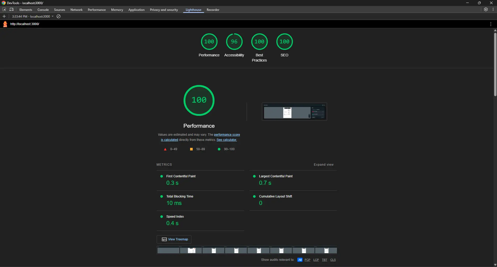
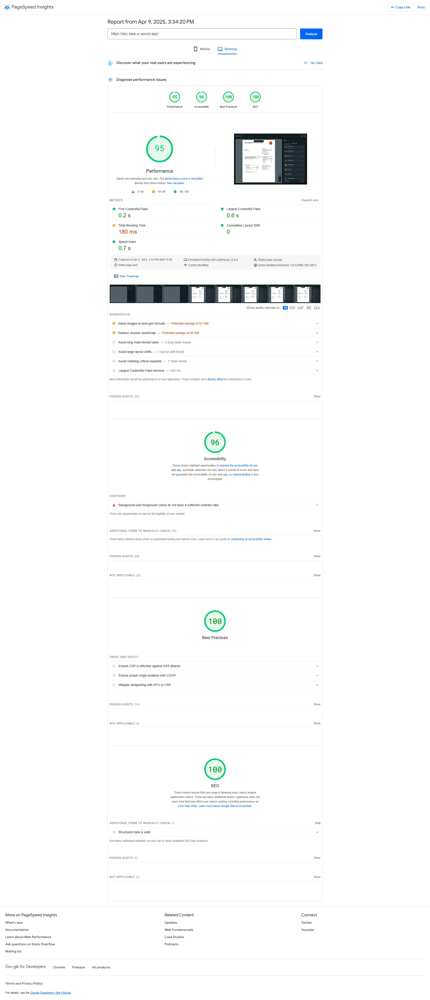
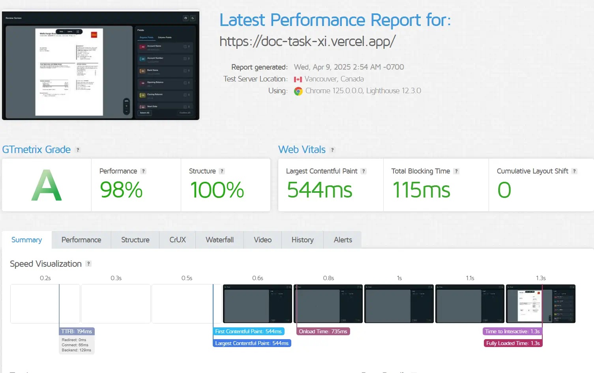

# 🚀 [Document Reviewer Application Demo] – Next.js 15 Application

A modern web application built with **Next.js**, **TypeScript**, and a fully customized setup for performance, scalability, and developer experience.

---

## ⚒️ Tasks Completed

- 📘 [Task Lists](./TASKS.md)

---

## 🧩 Tech Stack

- ⚛️ Next.js – React framework
- 🧠 TypeScript – Type-safe development
- 🎨 Tailwind CSS – Utility-first styling
- 🧱 shadcn/ui – Beautiful, accessible UI components
- 📦 Redux Toolkit – Scalable state management
- 🖼️ Konva + React Konva – Canvas-based rendering
- 🖍️ Sass – CSS with superpowers
- 🌗 next-themes – Theme toggling for dark/light modes
- 📡 Axios – HTTP client for API requests
- 🧠 Lucide React – Icon library
- 🔍 @next/bundle-analyzer – Bundle size analysis
- 📈 react-zoom-pan-pinch – Interactive zooming/panning
- 🍩 Sonner – Toast notifications

## 🧪 Tooling & DX

- 🛠️ ESLint – Linting
- 🧼 Prettier – Code formatting
- 🧪 Husky – Git hooks
- 🧼 lint-staged – Pre-commit lint/format
- 🧵 Prettier Plugin Tailwind – Format Tailwind classes
- 🐱 Yarn – Dependency management

---

## 📁 Folder Structure

```bash
project-root/
├── .husky/                          # Husky Configuration
├── public/                          # Static
├── src/                             # Source code
│   ├── @types/                      # Type Safes
│   ├── app/                         # App Router
│   │   ├── api\sections\routes.ts   # Define API routes logic
│   │   └── globals.css              # Global styles
│   │   ├── layout.tsx               # Root layout
│   │   ├── page.tsx                 # Main landing page
│   │
│   ├── components/                  # Reusable UI components
│   │   ├── header                   # Header Component
│   │   ├── layouts                  # Layout Component Wrapper
│   │   ├── loader                   # Loader Component
│   │   ├── preview                  # Main Document Previwer Components
│   │   ├── ui                       # ShadCN UI components
│   │
│   ├── data/                        # Mock or static data
│   ├── hooks/                       # custom hooks
│   ├── lib/                         # Utility functions
│   ├── services/                    # API calls
│   ├── store/                       # State management using Redux
│
├── components.json                  # ShadCN UI file
├── next-env.d.ts                    # Next.js typeScript type declarations
├── package.json                     # Dependencies
├── postcss.config.mjs               # PostCSS configuration
├── README.md                        # Project Documentation
├── TASKS.md                         # Project Documentation
├── tsconfig.json                    # PostCSS configuration
├── yarn.lock                        # PostCSS configuration
```

---

## 🚀 Getting Started

### Prerequisites

- Node.js version 20.x or higher
- Yarn for dependency management

### Installation

1. Clone the repository:

    ```bash
    git clone <repository-url>
    cd <project-directory>
    ```

2. Install dependencies:

    ```bash
    yarn
    ```

3. Start the development server:

    ```bash
    yarn dev
    ```

4. Open your browser and go to [http://localhost:3000](http://localhost:3000).

---

## ⚡ Lightspeed Insight







## Deployment

- Application is hosted in vercel server - [doc-task-xi.vercel.app](doc-task-xi.vercel.app)
